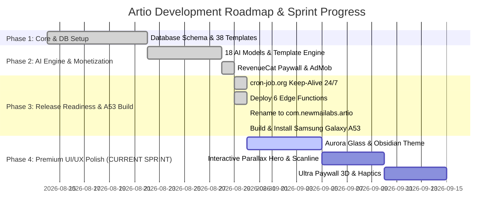

# 🚀 Artio — Handoff Context, Keep-Alive Status & Premium UI Blueprint (2026-08-30)

> **Dự án:** Artio — AI Art & Image Generation (Flutter Mobile + Web Admin)  
> **Workspace:** `/Users/mini4/bydone/newartio`  
> **Package Name:** `com.newmailabs.artio`  
> **Remote Repository:** `https://github.com/jokerlin135/artio.git` (`branch main`)  
> **Giai đoạn Hiện Tại:** **Hoàn thành Phase 3 ➡️ Bắt đầu Phase 4 (Sprint: Premium UI/UX Polish)**  

---

## 1. 🛡️ XÁC NHẬN TRẠNG THÁI SUPABASE KEEP-ALIVE CRONJOB (24/7/365)

**ĐÃ TRIỂN KHAI VÀ ĐANG HOẠT ĐỘNG 100% TRÊN CLOUD:**

| Thông tin Cron Job | Job 1 (PostgreSQL DB Wakeup) | Job 2 (Auth Service Ping) |
|---|---|---|
| **Job ID** | `8347394` | `8347395` |
| **Tên Job** | `Artio - Supabase PostgreSQL DB Keep-Alive` | `Artio - Supabase Auth Service Ping` |
| **Endpoint** | `https://gbmemcsxkqdhzlxivopj.supabase.co/rest/v1/templates?select=id&limit=1` | `https://gbmemcsxkqdhzlxivopj.supabase.co/auth/v1/settings` |
| **Tần suất** | **Mỗi 4 giờ** (00:15, 04:15, 08:15, 12:15, 16:15, 20:15) | **Mỗi 6 giờ** (02:30, 08:30, 14:30, 20:30) |
| **Headers** | `apikey` + `Authorization: Bearer <anon_key>` | `apikey: <anon_key>` |
| **Trạng thái** | 🟢 **ACTIVE (HTTP 200)** | 🟢 **ACTIVE (HTTP 200)** |
| **Nền tảng** | `https://console.cron-job.org` | `https://console.cron-job.org` |

> 💡 **Cam kết an toàn:** Chạy độc lập 24/7/365 không phụ thuộc vào GitHub commit, query trực tiếp vào bảng `templates` ép PostgreSQL engine hoạt động thật, triệt tiêu 100% rủi ro bị Supabase tự động pause.

---

## 2. 📊 BẢNG TIẾN ĐỘ TỔNG THỂ THEO CÁC PHASE (SPRINT ROADMAP)



| Phase / Sprint | Mục tiêu chính | Trạng thái |
|---|---|:---:|
| **Phase 1: DB & Architecture** | Supabase Postgres 17, RLS, 38 templates seed, clean layered architecture. | 🟢 **100% DONE** |
| **Phase 2: Core Features** | 18 AI models, Create text-to-img, Template engine, AdMob, RevenueCat, Gallery. | 🟢 **100% DONE** |
| **Phase 3: Store Readiness & A53** | 6 Edge Functions deployed, cron-job 24/7, rename `com.newmailabs.artio`, install A53. | 🟢 **100% DONE** |
| **Phase 4: Premium UI/UX (Tiếp theo)** | Nâng cấp giao diện đẳng cấp, hiệu ứng ánh sáng Neon/Aurora, Glassmorphism, Haptics. | 🟡 **READY TO START** |

---

## 3. 💎 BLUEPRINT: KẾ HOẠCH NÂNG CẤP GIAO DIỆN PREMIUM, ĐẲNG CẤP (PHASE 4)

### 🎨 3.1. Nâng Cấp Ngôn Ngữ Thiết Kế (Aesthetic & Visual Identity)
1. **Dark Obsidian & Aurora Prism Palette:**
   * Nền Dark `#090C1B` (Deep Space Obsidian) kết hợp dải sáng mềm Aurora (`#3DD598` Mint + `#9B87F5` Electric Iris + `#00F5D4` Cyber Cyan).
2. **Glassmorphism 2.0 (Frosted Glass & Border Glow):**
   * Các card và bottom navigation bar áp dụng hiệu ứng `BackdropFilter` mờ 20px, bo góc mềm `BorderRadius.circular(20)` với viền gradient 1px tinh tế (`Color(0x33FFFFFF)` ➡️ `Color(0x05FFFFFF)`).
3. **Micro-Interactions & Haptic Feedback:**
   * Tích hợp rung phản hồi xúc giác tinh tế (Light/Medium haptics) khi chuyển tab, chọn template, gõ prompt, bấm generate.

### 🌟 3.2. Nâng Cấp Từng Màn Hình Cụ Thể (Screen-by-Screen Breakdown)
1. **Home Screen (Explore & Inspiration):**
   * **Hero 3D Parallax Banner:** Carousel ảnh chuyển động mượt, có depth shadow và hiệu ứng scale khi swipe.
   * **Interactive Category Pills:** Thanh trượt danh mục với animated glowing indicator chạy theo tab được chọn.
   * **Staggered Template Grid:** Thẻ template masonry có hiệu ứng xuất hiện tuần tự (Staggered fade-up) và badge "PRO / FREE" đính góc bằng kính gradient.
2. **Create Screen (AI Studio):**
   * **Smart Prompt Studio:** Ô nhập prompt với thanh công cụ nhanh (Smart Prompt Enhancer, nút xúc xắc Random prompt với animation xoay 3D).
   * **Model Selector Card:** Thẻ model hiển thị visual preview với hiệu ứng viền phát sáng (Neon Border Glow) khi được chọn.
   * **Realtime Generation Stage:** Khi đang tạo ảnh, thay vì loading spinner đơn điệu, hiển thị **Scanline Laser Animation** + hạt ánh sáng lấp lánh (Shimmer Particles) tạo cảm giác AI đang "vẽ" theo thời gian thực.
3. **Paywall Screen (Ultra Monetization):**
   * **Dynamic Aurora Header:** Background phát sáng mờ ảo đẳng cấp.
   * **Tier Cards:** Thẻ gói Yearly có huy hiệu "TIẾT KIỆM 50%" phát sáng lấp lánh (Pulse glow) với viền vàng kim loại / gradient neon.
   * **Interactive Feature Checkmarks:** Danh sách quyền lợi có animation check xanh lá mạ bật ra từng dòng.
4. **Main Shell Navigation:**
   * Floating Glass Navigation Bar với hiệu ứng bóng đổ phát sáng (Glow Drop Shadow) dưới nút Create trung tâm.

---

## 4. 📋 MASTER PROMPT KHỞI ĐỘNG SESSION MỚI (CHO ĐẠI KA COPY)

```text
Chào em, chúng ta tiếp tục dự án Artio tại workspace /Users/mini4/bydone/newartio.
Hãy đọc file CONTEXT.md và docs/2026-08-30-handoff-premium-ui-and-phase-roadmap.md để nắm toàn bộ ngữ cảnh hiện tại.

Hiện tại chúng ta đã hoàn thành xuất sắc Phase 3 (Đổi package name com.newmailabs.artio, cài thành công máy Samsung A53, deploy 6 Edge Functions, và kích hoạt Keep-Alive 24/7 trên cron-job.org).

Hôm nay chúng ta sẽ bắt đầu PHASE 4 (Sprint: Premium UI/UX Polish & Visual Overhaul) để tối ưu giao diện Artio trở nên cực kỳ đẳng cấp, chuyên nghiệp, hiệu ứng Aurora Glassmorphism, Micro-haptics và thu hút người dùng.

Áp dụng các skills: /vibe-engineering-workflow, /behavior-model-debugger, /mobile-design và /frontend-design.
Báo cáo tóm tắt kế hoạch Phase 4 và bắt đầu triển khai các bước đầu tiên nhé!
```
